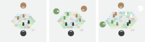
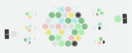

# optimal weave

# 0.1

# how to

The play objective is to pursue your character's desires and see how much you can optimize the board-world towards perfection. The real objective, which comes as a result of pursuing the play objective, is to practice dealing with conflict in a lawless place, to learn to weave harmony amid exposed difference.

You may wish to try playing with or without contracts. Contracts are agreements that two players can make where one player will take a -10 point punishment if a specified event occurs, or if they fail to hold up their end of an exchange. With contracts, Optimal Weave can be seen as an anarchic blank canvas onto which players may experiment in scribbling their own laws and learning what works.

As players improve, they should introduce more complex abilities, desires and scenarios. If a player's average score over the past five games they played is above par for their current level, they transcend to the next level.

# before the first game

Your land tiles will be sooty from the laser cutting. Wipe the soot off of the edges of your land tiles onto a damp towel.

Separate cards marked with  and set them aside for later. These cards are *clowns* and should only be played for novelty once you're able to understand the delightful ways they disrupt the game.

# level 1

## setup

Start by assinging everyone so many randomized desire and ability cards, depending on how many players you have, according to the following figure. Take care not to use any cards marked . I think their behaviors make the game a bit too complicated for a first session.

Start by getting to know your own desires, and how they project meaning onto the landscape.

Then get to know everyone else's desires and how they compliment or conflict with yours.

As you do that, depending on how many players there are, lay out land tiles and place everyones' agents into the world according to this figure:

It's important that no agent starts out within immediate reach of another, as some characters may eat others.

You will start to see things you can do, and other things that you would like to do but cannot. Soon, though, you will each receive many more abilities, as game events, and your options will sprawl.

Game events will also decide when the game ends. Assemble the event deck according to the following figure:

## begin play

Each turn, each of a player's pieces can move once, and apply an ability once, in any order.

Turns should be limited to 1 minute (everything that's tricky about real world negotiation is about the way it strains under time constraints). After 1 minute, you must carry out your choice. You don't need to be strict about this, though.

At the end of each player's turn, they should draw an event card. If that event card is an ability, they have gained that ability. If it's a "clear" , nothing happens. If it's a "ending" , then the game is over, and it will be time to take your scores and reflect, and talk about what could have been done better.

As you do this, convert your points into `reward`, which is either fruit or candy or whatever treat you find appropriate, and eat it. We recommend an exchange rate of one date per 8 points (or one dried fig per 12 points). Let players keep leftover points between sessions so that they don't go to waste. If you've won too much `reward` to eat on your own, you *may* share the spoils with others. There are many things about the `reward` system that are wonderful, but one of them is that it makes it very clear how we're supposed to relate to points: You want as much `reward` as you can get, and it doesn't harm you when other players receive `reward`. These things may seem obvious given the `reward` framing, but without it, it can be surprisingly difficult to get board gamers to think of points in this way.

Take a note of your score. If the average of your past 5 games were above 16 (?), that's very good, and you have transcended, you become a being of peace, and you may begin to play level 2 games with other transcended players. ●

To make things easier at first, you may wish to keep your characters' ability cards together for the next game you play. Instead of rerolling an entirely new character, you may prefer to just play a mutation of your previous abilities or desires by replacing a random one with a random new one. It's much easier to orient yourself in a new situation if it's a variation on a scenario you've played recently. Of course, for the purposes of deciding when to move onto level 2, this will make the average scoring less "fair", so factor accordingly.

## the mindset of play

A common source of challenges in our cohabitive praxis is managing the mindset of other players. Not all of your players will understand that win-win bargaining is possible, they will carry the mindset of more common zero-sum games where only one player can win, at the expense of making other players lose. This section tells you how to hold and to convey this mindset.

One thing you might like to do is to make score convertible to candy, or dried fruit. The more points you score, the more candy you get. In this framing, it will be obvious to any player that preventing other players from getting candy will not advantage them in any way. Personally, I like a scoring scheme where 6 points can be cashed in for one slice of dried mango.

You might also like to play for dollars, but this is complicated by having to maintain a prize pool.

Beyond that, here are some thoughts and sayings that will help you to convey the cohabitive mindset.

*"The objective within the game is just to score as much as possible for yourself. The objective outside of the game, in the real world, is to learn the way of negotiation, of confronting difference and striving towards the optimal weave."*

*"The point of the game is to reckon honestly with selfishness and atomization, and then find the sacred patterns of coordination that survive it."*

*"Bicker all you like, but in the end we will all agree, because there will only be one world, and one history, which we will all have to live through together."*

*"Reducing others' scores will not increase your own."*

*"The game is kind of cooperative, but also not. It's cheeky."*

*"More than one person can win."*

*"You win whenever you get the best feasible outcome for yourself. You lose if you miss opportunities and fall far short of that. If there's war, mutual assured punishments let loose, then everyone has lost."*

Don't be too frustrated with players who need to be told these things, for you shall meet such players in life, as well. Relish any opportunity to practice lifting crabs out of their buckets, it's a necessary art.

## developer corner

<!--  -->

*A salve for strife and waste*  
*In these primal lands*  
*It can be found*

We're still learning to make Cohabitive games, so let's all explore the cohabitive genre and develop this game and the broader genre together!

I encourage players to look for new interesting variants of play, and to come and tell us what you found in the <a class="element_link" href="https://matrix.to/#/#peacewagers:matrix.org">element channel</a>.

For the explorers, here's a verdant list of ideas we'd be eager to see tried with Optimal Weave 0.1, or in any other brew:

- Consider reusing state between sessions. The game involves learning a lot of intricate strategic relationships, throwing those away before each game seems like an inefficient use of brain.

    - Retaining desires between sessions makes sense. Though, if you're taking average cumulative score over multiple games to get a metric of player skill, since a lot of the randomness in player scores is just downstream of whichever desires they've been assigned, make sure to not take more than one score from stretches of games where players are using the same desires.

    - Adding more random elements would *sort of* achieve state reuse if you think of the bouts of play between random event as very distinct epochs or challenges. But if you include prediction and hedging about random events within your conception of the game, you'll both do better between epochs and have less fun, so I don't love it. It's only comparable if players think of random events as *totally* unpredictable and basically ignore the possibility of them until they happen, which is a natural mindset in some situations, but usually not in board games, and never in real life (unless you're a corrupt insurance firm).
    
- Oh, for that, how about an infinite variant of the game where players move over an ever-shifting land periodically subject to cataclysms. In each cataclysm, they take their scores, then replace one of their desire cards with new random draws, augmenting themselves with new abilities that they find scattered over the new landscapes to adapt to changing needs and conditions in whatever ways seem necessary.

    - Now that's efficient reuse of state!
    
    - The abilities used in this mode would have to be kept balanced. One of the upsides of cohabitive games is that you don't have to power-balance abilities very much, power imbalances don't usually threaten strategic depth, so I mostly haven't done that with Optimal Weave 0.1, there are weak abilities and strong abilities, but for an infinite mode to stay diverse, it's good if players don't get stuck with any ability set. We want to make sure that all infinite mode abilities are situational, so that there will eventually come at time when they're no longer ideal. Or at least, that's one way of doing it.
    
        - I'm considering another approach where players can banish abilities from other players that they do not like. This would do it in a purely competitive game, because the most powerful abilities would be the ones that would tend to be removed, but in a cohabitive game it wouldn't work! If you have good trade relations with other players, they'll often prefer for you to keep your extremely powerful ability. You'll be stuck with it!

- We may want mechanics that allow people to fight against or veto the introduction of abilities that break the power balance. I look forward to the contracts people will pen here, eg, "you can have this ability if you promise to only use it in constrained ways", this essentially constitutes the design of new abilities from broader ones.

    - Experiment with vetos and votes of support. This may warrant additional mechanics. Having to navigate a tradeoff between getting your own abilities and controlling the abilities others can take would be an interesting alegory for contemporary regulatory dilemmas (assuming those are real dilemmas, though I'm not sure they are. They always end up seeming like a result of incompetence in system design).

    - Making acquisition vetoes be just a natural consequence of the base mechanics of movement and violence may be a good idea. I just can't see how to fit it onto the board. How can we place abilities into the landscape? Another call for card stands.

- If players could score some minimal amount by voting to end the game early, such that this is a preferable move if they're only going to be scoring very small amounts in the late game, this could cut out some tedium, assuming that an endgame where not much is being scored is a boring endgame.

- How about some Gaianism: Sometimes the world itself will have a desire, which is part of everyone's score. It might make some gameplay sense to tilt things a little bit in favor of cooperation. It would make it all feel more respectful towards the land and its whims. But I don't think this is necessary.

- Random events in the event deck?

    - Ways of fighting off ending  events?/ending events that are designed to be fought against?

Those are mostly just ideas for Optimal Weave, but if you find any of those interesting, I also encourage you to check out [this page of ideas for other cohabitive games](cohabitive_game_ideas.html).

# level 2

After scoring consistently above 15 on level 1, you may "transcend" to level 2.

- Cards marked  start to come into play, and cards marked  may be removed. Be conscious of which cards you include. Those with the mark of the clown should be considered to be novelties, they drown out the other ingredients and only teach a simple lesson, so those ones should only be played with a few times.

- mess around with advanced movement rules, where some land types are a bit more difficult to traverse, imbuing the landscape with more texture:

● an agent can only move onto a mountain/volcano if that's the only action it takes on that turn  
● an agent can only move out of water if that's the only action it takes on that turn  
● agents cannot go directly from lakes to mountains  
● voids are impassable and any agent standing on a tomb when it is dissolved into a void will die  

- Also consider increasing the number of desires or abilities players have, as this always tends to make finding the optimal solution more complex.

- Play larger games with more players.

- Reduce the amount of time people have per turn.

- Adjust board size to taste.

- See the [Developer Corner](#developer-corner) section and get experimenting!

# Ritual

A separate game using some of the parts of Optimal Weave.

Ritual Cohabitive is simple but deep. Its purpose is to quickly test the negotiation skills of the table, perhaps as a prelude to an important negotiation, or a new friendship. There's often benefit in exhibiting a demonstration that all participants are capable of good faith negotiation. When there is common knowledge of this, expectations will be heightened, and similar performance will be expected as you continue on into your inevitably foggier real-world collaborations.

Games are brief. At the end of the game, scrutinize and discuss the negotiation outcome. If it was unfair to you, well, that is one thing. But if it was too generous to you, that's a very different thing. Either case is an omen. If playing Ritual Cohabitive causes omens for you, consider playing additional rounds until omens cease.

## Rules

Setup: Lay out a random board of radius 3 (that's 37 land cards).

Give each player:

- 1 single-element desire card, making sure that no two players have opposed elements (unless you have more than four players, in which case you have to allow it), EG, if one player is maximizing lakes, try to avoid giving another player the ice desire.

- if there are just two players, give each 3 flip all abilities. If there are three or more players, give them each 2.

Each turn, each player may activate two of their flip actions. (Ignore the rule stating that the player must be standing on the pattern, the player has no earthly agents, in Ritual, and can flip any matching pattern.)

The game goes on for just 4 rounds if there are two players, 3 rounds if there are 3 players or more.

After that, no further actions can be taken, the outcome is determined.

# Pieces

The official names for the teams of agent pieces we've bundled with the game are:

● Pearls (or "Glue")  
● Slimes (or "Frutiger")  
● Church (or "Sunday")  
● Sheep (or "Flock")  
● Figures (or "Lollards")  
● Cubes (or "Smokies")  

## What are voids? What are tombs?

Some say that each voidland is a place where a great hole has been torn all the way to the shadowed heart of the earth. Others say that a void represents something more abstract, a wound in the body of justice or memory, festering and cursing its site.

And I've heard some say that tombs are places that a good spirit protects, or monuments to a great act of redemption.

Personally, I think the voids are nuclear wrecks. Failed machines that killed their builders and now spew radiation in every direction. I think the tombs are containment mounds, and if we could build more tombs we would be able to make those lands safe to traverse again.

But I haven't been able to find anyone else who will come work beside the voids with me.

2024. All assets available under GPLv3. <a href="https://dreamshrine.org" style="color: inherit;">dream shrine</a> are open to negotiating other licenses if needed.